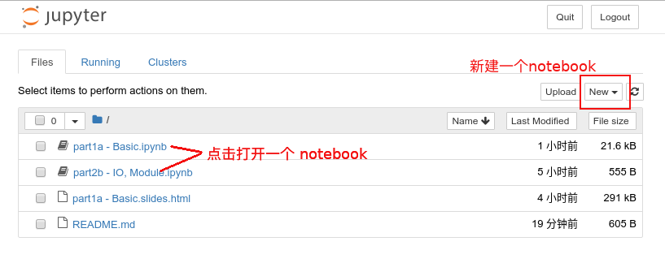

# 环境配置

+ [Anaconda](#Anaconda)
+ [Jupyter](#Jupyter)
+ [编辑器](#编辑器)
+ [其他](#其他)

## Anaconda


Anaconda 提供了一个跨平台的 Python 发行版以及
通用的软件、软件包依赖管理系统，非常适合于生物信息软件的管理。
本文提供一系列关于如何配置基于 Anaconda 的 Python 计算环境配置指导。

### 下载

Anaconda 是一个较为完整庞大的 Python 发行版，内置一系列常用的 Python 包以及
开发工具，安装包比较大。通常我们推荐安装 Anaconda 的精简版本 Miniconda，
它仅提供了 Anaconda 套件中最为核心的部分，
包括一个 Python 解释器，一个软件管理器: conda，以及一些其它的必要设施。
安装它只需要打开官网
[下载页面](https://docs.conda.io/en/latest/miniconda.html)
选择与操作系统相对应的版本进行下载。

注意：这里最好不要下载 Python 2 的版本
（2020年Python社区就会放弃对于Python2的支持，
很多[第三方库](https://python3statement.org/)也会这么做，
而现在已经是 9102 年了..），虽然你可以使用conda创建任意版本的
Python 环境，但你的 base 会默认是 Python2（虽然你可以随时改掉它），
Python2 的时代已经过去了，让它走吧。

### 安装

下载完成后，根据不同操作系统对应版本的不同进行安装，Windows 下
只需按照 exe installer 的指导一步步安装即可。Linux, Mac
下需要执行安装脚本进行安装。

``` bash
bash Miniconda3-latest-Linux-x86_64.sh
```

详细的操作可以参考[此处](https://conda.io/projects/conda/en/latest/user-guide/install/index.html)

### 配置

安装后为保证 conda 能被操作系统找到，需要正确配置。Windows 下
需要将 miniconda 的 bin 路径（位于miniconda的安装目录下）
放在 PATH 环境变量下。
关于如何修改 PATH 变量，可以参考[这里](https://www.architectryan.com/2018/03/17/add-to-the-path-on-windows-10/)。

Linux 下，安装后需要确保 conda 被正常配置，可执行 conda init 指令完成配置。

``` bash
/path/to/miniconda/bin/conda init
```

注意，此处 `/path/to/miniconda` 代表的是你的miniconda的安装路径。
完成初始化后，conda 会修改你的 bashrc 文件，需要使用 source 命令对其重新加载：

``` bash
source ~/.bashrc
```

### 使用虚拟环境管理软件

在实际使用情景下，有时软件包之间会存在[依赖关系冲突](https://en.wikipedia.org/wiki/Dependency_hell)，
conda 提供了一种解决方案，创建不同的虚拟环境将彼此分割开来，
从而解决依赖冲突问题。日常使用时为不同任务创建不同的虚拟环境是一种好习惯。

#### 创建虚拟环境

创建一个为本课程使用的环境，命名为 jcbio：

``` bash
conda create -n jcbio python=3.6  # 创建虚拟环境 jcbio，指定 Python 版本为 3.6
```

#### 切换至虚拟环境

我们可以列出当前所有的虚拟环境：

``` bash
conda env list
```

切换至课程所使用的虚拟环境 jcbio：

``` bash
conda activate jcbio
```

#### 添加 channels

conda 允许用户安装来自不同的 源(source) 的软件，只需要添加 channel 即可。
考虑到国内的网络环境，往往使用 conda 安装软件时速度较慢。好在清华大学建立了
一系列[镜像](https://mirrors.tuna.tsinghua.edu.cn/help/anaconda/)，
对此状况有所改善。我们可以通过以下命令添加清华的镜像：

```bash
conda config --add channels https://mirrors.tuna.tsinghua.edu.cn/anaconda/pkgs/free/
conda config --add channels https://mirrors.tuna.tsinghua.edu.cn/anaconda/pkgs/main/
conda config --add channels https://mirrors.tuna.tsinghua.edu.cn/anaconda/cloud/conda-forge/
conda config --add channels https://mirrors.tuna.tsinghua.edu.cn/anaconda/cloud/bioconda/
conda config --set show_channel_urls yes

```

#### 安装软件、软件包

在该虚拟环境中，安装上课所需的软件包：

``` bash
conda install numpy scipy matplotlib jupyter
```

## Jupyter


[Project Jupyter](https://jupyter.org/) 
为 Python 以及其他众多编程语言提供了十分便利的
交互式计算环境： Jupyter notebook 与 Jupyter Lab。
前者 Jupyter notebook 顾名思义，你可以理解为就是一个记事本，我们可以在记事本中写入很多各种各样的 内容，比如文字、图片、视频等等，你可以用它来写日记、作实验记录，甚至用来
[写书](https://jupyter.org/jupyter-book/intro.html)。
和一般所理解的 notebook 没有什么不同。<del>真的吗？</del>
只不过比较特殊的是它可以嵌入代码，并且可以实时的运行代码，并返回运行的结果。
这样就很适合我们来用它作交互式的数据分析了，并且甚至分析完当场就有了一份
实验记录加数据分析报告。多好用啊！这也是我们的教程选择它的原因。
至于 Jupyter Lab，你可以理解为是 notebook 的加强版，有更多的功能，
但也更加复杂，我们这里只介绍 notebook。

### 启动 Jupyter notebook

这里我们介绍一些 Jupyter notebook 的基本使用。
在上一步中，我们已经完成了 Jupyter 环境的安装，可以打开终端，输入：

``` bash
jupyter notebook
```

启动一个 Jupyter server，如果你在安装了图形界面的操作系统中进行操作，
这时会自动弹出一个浏览器窗口。会显示你启动 jupyter 时候所在的文件目录。
比如我们在本教程的 `part1-basic/` 目录下打开，你可以在此界面下创建
notebook，或是打开目录下存在的 notebook（文件结尾为`.ipynb`）：



### notebook 使用

新建或者进入一个 notebook 后，点击右上角菜单栏中的 Help -> User Interface Tour，
Jupyter 内置的帮助会将界面的一些详细信息告诉你。总的来说，使用 notebook
就是编辑与运行一系列 `Cell`，一个 `Cell`你可以认为是一个比较小的内容分割单位。
你可以鼠标点击一个单元格，按 `Enter` 键进入编辑模式，对其中的内容进行编辑，
然后使用快捷键 `Ctrl+Enter` 运行该单元格。


你还可以通过使用界面上方的菜单或者快捷键，创建、删除以及移动`Cell`。
一个 `Cell` 一般来说可以有两种模式：代码模式和文档模式。代码模式下你可以编写、运行代码。
而在文档模式下，你可以通过 Markdown。
Markdown 并不难，而且十分方便使用，你可以参考 GitHub 的
[Markdown 语法说明](https://github.com/adam-p/markdown-here/wiki/Markdown-Cheatsheet)
很快学会它。
语法编写具有格式的文字、插入图片、公式等等，然后运行该`Cell`就能将文档进行渲染。
嗯，图形界面的软件，我在这里用文字来讲解如何使用实在是显得太无力，不如你自己打开界面探索一番，
遇到那里不会就看一下 Jupyter 的文档，或上网找一下视频教程。

### 将 notebook 转换成 slides

课程上使用的slides也是由 notebook 转换得到的。具体命令为：

``` bash
jupyter nbconvert [path/to/notebook.ipynb] --to slides --post serve --SlidesExporter.reveal_scroll=True --SlidesExporter.reveal_transition=none
```

## 编辑器

对于我们的教程来说，代码几乎放在Jupyter notebook之中，但有时你也需要一个好用的编辑器
来编写 Python 脚本、模块、包。如果你有自己喜欢的编辑器，并且足够好用的话可以跳过本节。

目前对于编辑 Python 代码，一般来说有两种选择，一种是选择较为轻量级的
文本编辑器(Text editor)，适用于广泛的（不仅限于Python）代码、文本编辑，
其中比较常见且功能足够丰富的比如说：

+ [VSCode](https://code.visualstudio.com/)：微软的开源项目，目前具有非常高的人气。
+ [Atom](https://atom.io/)：GitHub开发的一款开源文本编辑器。
+ [Sublime Text](https://www.sublimetext.com/)
+ 当然还有老牌的 Vim 与 Emacs，对于新手来说不是很友好，但二者都对其它的编辑器设计产生了相当深远的影响。

你可以选择以上任意一种或者其他你喜欢的编辑器来编写Python代码，但要注意需要安装针对
Python的插件，以支持 Python 的语法高亮和代码补全，以提供方便。

另外一种选择是使用 IDE（Integrated Development Environment, 集成式开发环境）
相较于文本编辑器，IDE 往往对于特定的语言有更好的优化，对代码有更好的语法分析，
更智能的提醒、纠错功能，但同时也会消耗更多的计算机资源（内存、CPU）。对于 Python
来说，选择有：

+ [PyCharm](https://www.jetbrains.com/pycharm/)：IDE 大厂 JetBrains 的
产品，功能十分强大，同时有非常丰富的插件。社区版是免费的，一般来说免费版本的功能已经足够
使用。如果你是学生，可以通过学校邮箱申请，得到一个免费的专业版。
+ [Spyder](https://www.spyder-ide.org/)：一个开源的Python IDE，界面与
RStudio 非常相似，如果你原来是 R 用户，也许可以试试。

以上只是提供了一些选择，总体来说这些都可以，选择哪一个就看你自己的兴趣了。

## 其他

### FAQ

Q: 1. 我是新手，看完之后还是装不好，怎么办?

A: 也许你可以去网上找一些视频安装教程，这样会更直观一些，比如在 bilibili 上搜索关键字
"Anaconda"、"Jupyter"。

